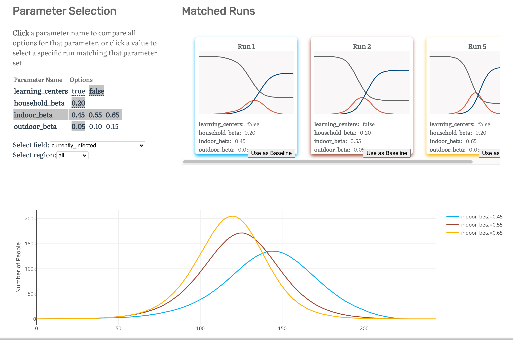
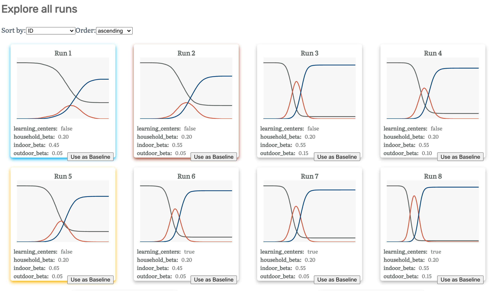
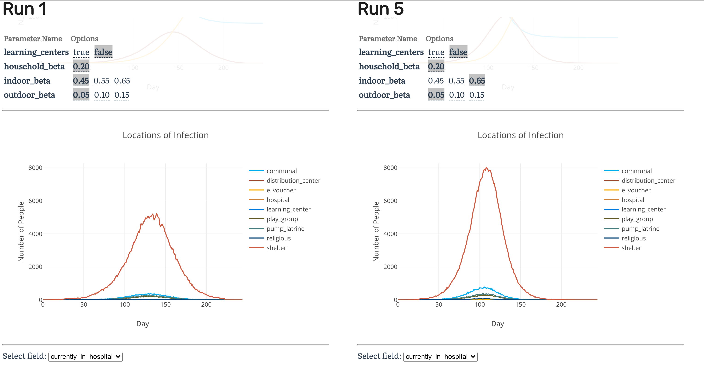
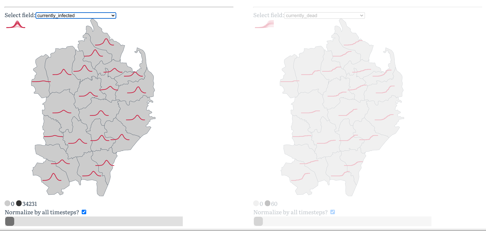
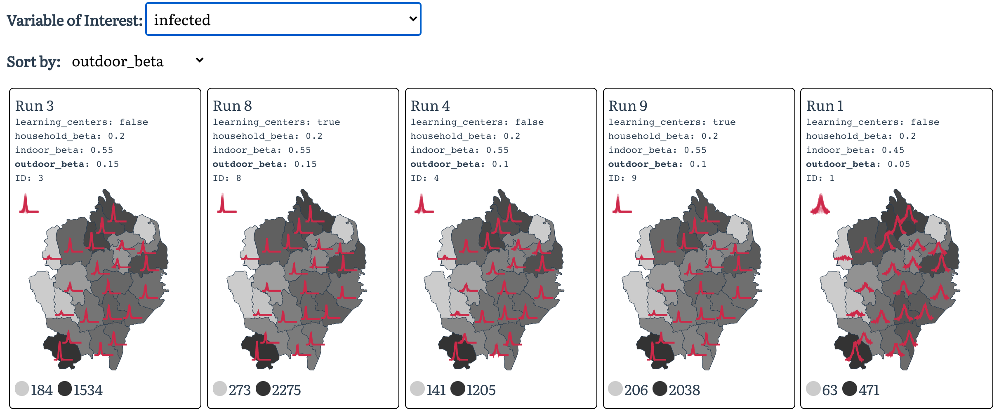

# JUNE-vis
> A dashboard to visualize the JUNE simulation results for epidemic modeling and intervention


## Install

`pip install junevis`

## Serve the Example Project

This code ships with an example project (`mask_wearing`) for the interface. From the command line, run:

`junevis_serve` 

## Add new simulation results to JUNE-vis

The `JUNE` simulation logs events as they occur into hdf5 files called `records`. These are transformed into csv files called `summaries` that are automatically placed into a folder the frontend interface can serve. To create a new visualization from a simulation,

`junevis_create path/to/folder/containing/records`

For more details on the expected contents of this folder, see [this documentation](`https://bhoov.github.io/JUNE-vis/Create%20Project.html`).

### Changing the homepage

You will need to clone the source code if you want to change the landing page to describe the set of simulation results deployed. The file to change is in `junevis/client/src/views/Intro.vue` (this is a `.vue` file that contains all the needed HTML, CSS, and javascript).

After cloning and making your desired changes, from this project's root:

```
pip install -e .
cd junevis/client
npm install
npm run build
junevis_serve
```

### Deploying

You can easily host this for others to see by running `junevis_serve` and exposing (default port) `8000`. 

# Walkthrough

## The Explore Page

### The parameter selection grid

Choose which runs to compare across a single dimension:

 

The parameter grid (left) is designed so you can view a single simulation by clicking on a valid combination of hyperparameter values. Alternatively, you can highlight all the values of the hyperparameters by clicking on the name of the hyperparameter to compare simulations accross all values of that dimension.

### A card and SIR cruve for every simulation

Every run is associated with a set of hyperparameters. Its effect can be summarized with an SIR curve, shown as the thumbnail:

 

## The Detailed Comparison Page

Sometimes we want to compare simulations across more subtle effects, such as the difference in where the infections occurred, shown below:

 

You can add any additional plot here to compare between two simulations. Included are SIR curve, ages of the infected, the locations of infection, and a detailed geography overview:

 

The slider will color the background of each region according to the selected dimension at that point in time.

## The Geography Overview

To see the geographical effects of all simulations at once, we include a special page to sort and observe the peak value at each location for the course of a simulation:




## Known Bugs

- Rendering the geojson associated with the map of England does not work
- Creating a new project using the PyPI package will overwrite existing projects. We need to move processed projects into a configuration folder in the home directory and symbolically link them to the client
